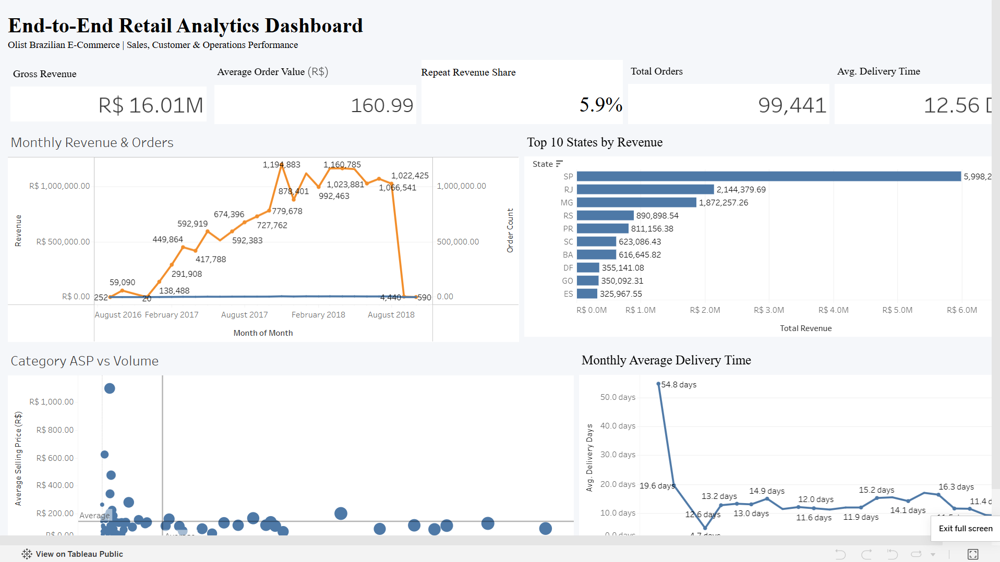
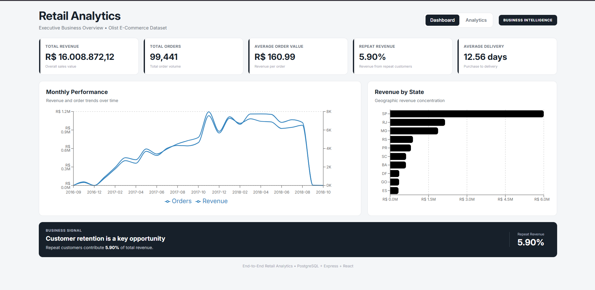
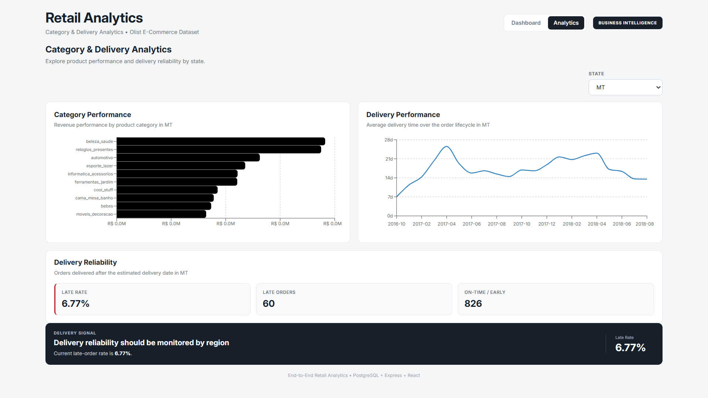

# End-to-End Retail Analytics

A complete retail analytics project built using **PostgreSQL, SQL, Tableau Public, Node.js, Express.js, React, and Recharts**.

The project takes a real-world Brazilian e-commerce dataset and turns it into validated business analytics through two complementary interfaces:

1. **Tableau Public Dashboard** — a professional BI dashboard for executive-level analysis.
2. **React Web Application** — an API-driven analytics product built on top of PostgreSQL.

The project demonstrates the complete workflow:

```text
Olist E-Commerce Dataset
          ↓
      PostgreSQL
          ↓
     SQL Analytics
          ↓
   ┌──────┴───────┐
   ↓              ↓
Tableau         Express API
Dashboard           ↓
                 React App
```

---

## Project Overview

Retail businesses generate large amounts of transactional data, but raw data alone does not provide useful business insights.

This project transforms raw e-commerce data into an analytics solution that helps answer questions such as:

* How much revenue is being generated?
* How many orders are being placed?
* Which states generate the most revenue?
* Which product categories perform best?
* How is sales performance changing over time?
* How long are customers waiting for delivery?
* What percentage of deliveries are late?
* How dependent is the business on repeat customers?

The project intentionally combines **analytics, business intelligence, backend development, and frontend development** without turning into an unnecessarily large system.

---

# Business Problem

The objective is to transform raw retail transaction data into a system that allows users to quickly understand:

### Sales Performance

* Revenue
* Orders
* Average Order Value
* Monthly trends
* Geographic performance

### Product Performance

* Category revenue
* Category sales volume
* Average selling price

### Customer Behavior

* Repeat customer contribution
* Revenue dependence on repeat customers

### Delivery Performance

* Average delivery time
* Delivery trend
* Late-order rate
* On-time / early deliveries

---

# Dataset

The project uses the **Olist Brazilian E-Commerce Dataset**, a publicly available relational e-commerce dataset containing approximately 100K orders.

The dataset includes information about:

* Customers
* Orders
* Order items
* Products
* Sellers
* Payments
* Reviews
* Geolocation
* Product category translations

The relational structure of the dataset makes it suitable for demonstrating SQL joins, aggregations, business analytics, and API development.

---

# Key Business Metrics

The validated project metrics are:

| KPI                       |                Value |
| ------------------------- | -------------------: |
| Total Revenue             | **R$ 16,008,872.12** |
| Total Orders              |           **99,441** |
| Average Order Value       |        **R$ 160.99** |
| Repeat Revenue Share      |            **5.90%** |
| Average Delivery Time     |       **12.56 days** |
| Delivered Orders Analyzed |           **96,476** |
| Late Orders               |            **7,827** |
| Late Order Rate           |            **8.11%** |
| On-time / Early Orders    |           **88,649** |

---

# Key Insights

### Geographic Performance

**São Paulo (SP)** is the largest revenue-generating state, followed by **Rio de Janeiro (RJ)** and **Minas Gerais (MG)**.

| State |         Revenue |
| ----- | --------------: |
| SP    | R$ 5,998,226.96 |
| RJ    | R$ 2,144,379.69 |
| MG    | R$ 1,872,257.26 |

This indicates a strong concentration of revenue in the largest markets.

### Customer Retention

Repeat customers contribute only:

**5.90% of total revenue**

This indicates that the business relies heavily on one-time customers and that customer retention represents an important opportunity.

### Delivery Performance

Average delivery time:

**12.56 days**

Among orders with the required delivery dates available:

**8.11% were delivered after the estimated delivery date.**

---

# Tableau Public Dashboard

The first analytical interface is a **professional single-screen Tableau dashboard** designed as an executive BI view.

## Tableau Dashboard Includes

### KPI Cards

* Total Revenue
* Total Orders
* Average Order Value
* Repeat Revenue Share
* Average Delivery Time

### Visualizations

* Monthly Revenue & Orders
* Revenue by State
* Category Performance
* Delivery Performance

### Design Goals

The Tableau dashboard was designed with:

* Single-screen layout
* Clear visual hierarchy
* Consistent typography
* Restrained color usage
* Minimal visual clutter
* Business-focused chart selection
* Executive-friendly presentation

---

# Tableau Dashboard Screenshots

> Add your Tableau dashboard screenshots here.

### Executive Overview



### Additional Tableau Screenshot


### Tableau Public

**Tableau Public Dashboard:**
[Add your Tableau Public URL here]

---

# React Web Application

The second interface turns the validated analytics into an **API-driven web application**.

The purpose of the web application is not to replace Tableau.

Instead, it demonstrates how analytical SQL logic can be exposed through a backend API and consumed by a modern frontend.

## Architecture

```text
PostgreSQL
    ↓
SQL Analytics
    ↓
Express REST API
    ↓
React
    ↓
Recharts
```

React never connects directly to PostgreSQL.

The backend acts as the API and database access layer.

---

# Web Application Pages

## 1. Executive Dashboard

The main dashboard provides an overview of business performance.

### Includes

* Total Revenue
* Total Orders
* Average Order Value
* Repeat Revenue Share
* Average Delivery Time
* Monthly Revenue & Orders
* Revenue by State
* Business Signal

### Screenshot



---

## 2. Category & Delivery Analytics

The second page provides deeper operational analysis.

### Includes

* State filter
* Category Performance
* Delivery Performance
* Delivery Reliability
* Late-order rate
* Late orders
* On-time / early orders
* Dynamic business signals

### Screenshot



---

# Interactive Filtering

The React application supports state-level filtering.

For example:

```text
All States
     ↓
SP
     ↓
RJ
     ↓
MG
```

The selected state is sent to the backend through query parameters:

```text
/api/categories?state=SP
/api/delivery/trend?state=SP
/api/delivery/reliability?state=SP
```

The backend applies the filter in PostgreSQL and returns the corresponding results.

This creates the complete flow:

```text
User selects state
        ↓
React state
        ↓
API request
        ↓
Express
        ↓
PostgreSQL
        ↓
Filtered JSON
        ↓
React charts
```

---

# REST API

The backend exposes a lightweight REST API for the analytical data.

## KPI Endpoint

```http
GET /api/kpis
```

Returns the primary business KPIs.

---

## Monthly Revenue

```http
GET /api/revenue/monthly
```

Returns:

* Month
* Revenue
* Order count

---

## Revenue by State

```http
GET /api/revenue/by-state
```

Returns state-level revenue and order counts.

---

## Category Performance

```http
GET /api/categories
```

Returns:

* Category
* Units sold
* Revenue
* Average selling price

Filtered example:

```http
GET /api/categories?state=SP
```

---

## Delivery Trend

```http
GET /api/delivery/trend
```

Filtered example:

```http
GET /api/delivery/trend?state=SP
```

---

## Delivery Reliability

```http
GET /api/delivery/reliability
```

Filtered example:

```http
GET /api/delivery/reliability?state=SP
```

---

# Technology Stack

## Data & Database

* PostgreSQL
* SQL
* pgAdmin

## Business Intelligence

* Tableau Public

## Backend

* Node.js
* Express.js
* `pg`
* dotenv
* CORS

## Frontend

* React
* Vite
* React Router
* Recharts
* CSS

## Development Tools

* VS Code
* Git
* GitHub
* Postman / Browser API testing

---

# Project Structure

```text
retail-sales-analysis/
│
├── backend/
│   ├── src/
│   │   ├── config/
│   │   ├── controllers/
│   │   ├── db/
│   │   ├── routes/
│   │   └── server.js
│   │
│   ├── .env.example
│   ├── .gitignore
│   ├── package.json
│   └── package-lock.json
│
├── frontend/
│   ├── src/
│   │   ├── components/
│   │   ├── pages/
│   │   ├── services/
│   │   ├── App.jsx
│   │   ├── index.css
│   │   └── main.jsx
│   │
│   ├── package.json
│   └── package-lock.json
│
├── data/
│
├── sql/
│
├── dashboard/
│
├── docs/
│   └── screenshots/
│       ├── tableau-dashboard.png
│       ├── tableau-dashboard-detail.png
│       ├── react-dashboard.png
│       └── react-analytics.png
│
├── README.md
└── .gitignore
```

---

# Data Analysis Workflow

The analytical workflow followed in this project was:

```text
1. Dataset Exploration
        ↓
2. Data Audit
        ↓
3. PostgreSQL Database Setup
        ↓
4. Data Import & Validation
        ↓
5. SQL Business Analysis
        ↓
6. KPI Validation
        ↓
7. Tableau Dashboard
        ↓
8. Express REST API
        ↓
9. React Web Application
        ↓
10. Integration & Testing
```

---

# SQL Analysis

The project uses SQL for core analytical operations such as:

* Aggregations
* Joins
* Grouping
* Date-based analysis
* Customer segmentation
* Revenue analysis
* State-level analysis
* Category analysis
* Delivery analysis
* Window functions

Examples include:

```sql
SUM(payment_value)
```

```sql
COUNT(DISTINCT order_id)
```

```sql
DATE_TRUNC('month', order_purchase_timestamp)
```

```sql
SUM(...) OVER (...)
```

---

# Revenue Definitions

The project uses different revenue definitions depending on the analytical question.

### Overall Revenue

Overall project revenue is calculated from:

```text
raw.payments.payment_value
```

This gives the validated total revenue:

**R$ 16,008,872.12**

### Product / Category Revenue

Category analysis uses product-level sales values from:

```text
raw.order_items.price
```

This distinction is intentional and should be considered when comparing category-level values with overall payment-based revenue.

---

# Testing & Validation

The analytical values exposed through the API were cross-checked against PostgreSQL and the Tableau analysis.

Validation included:

* KPI verification
* Monthly trend verification
* State revenue verification
* Category verification
* Delivery trend verification
* Delivery reliability verification
* API response validation
* React UI validation
* State filter testing

Example validation flow:

```text
PostgreSQL
     ↓
Validated SQL Result
     ↓
Express API
     ↓
React
```

The goal was to ensure that the application displays the same validated analytical results used during the BI analysis.

---

# Installation & Setup

## Prerequisites

Make sure you have:

* Node.js
* PostgreSQL
* pgAdmin
* Git

---

# Backend Setup

Move into the backend directory:

```bash
cd backend
```

Install dependencies:

```bash
npm install
```

Create a `.env` file based on `.env.example`.

Example:

```env
PORT=5000

DB_HOST=localhost
DB_PORT=5432
DB_NAME=retail_analytics
DB_USER=postgres
DB_PASSWORD=your_postgres_password
```

Start the backend:

```bash
npm run dev
```

The API runs on:

```text
http://localhost:5000
```

---

# Frontend Setup

Move into the frontend directory:

```bash
cd frontend
```

Install dependencies:

```bash
npm install
```

Start the React application:

```bash
npm run dev
```

The frontend runs on:

```text
http://localhost:5173
```

---

# Example Application Flow

```text
User
 ↓
React Dashboard
 ↓
REST API
 ↓
Express
 ↓
PostgreSQL
 ↓
SQL Query
 ↓
JSON Response
 ↓
React Visualization
```

---

# Why Both Tableau and React?

The project intentionally uses both platforms for different purposes.

## Tableau

Tableau provides:

* Rapid BI development
* Executive dashboards
* Visual exploration
* Interactive business reporting

## React Application

The web application demonstrates:

* REST API development
* Backend-to-database integration
* Frontend development
* Programmatic analytics delivery
* Product-oriented thinking

The React application is therefore **not intended to replace Tableau**.

Instead, the two interfaces demonstrate two ways of delivering the same validated analytical foundation:

```text
                 PostgreSQL
                     ↓
                SQL Analytics
                 ↙        ↘
          Tableau          Express API
            ↓                  ↓
      BI Dashboard          React App
```

---

# Limitations

This project intentionally has a limited scope appropriate for a college mini-project.

Current limitations include:

* Single Olist dataset
* No authentication
* No real-time data ingestion
* No transaction processing
* No automated multi-dataset ingestion
* No machine learning pipeline
* No forecasting system
* No recommendation engine
* No production-scale deployment architecture

The goal is to demonstrate **analytics + BI + API + web development**, rather than build a complete enterprise retail platform.

---

# Future Scope

Possible future extensions include:

* RFM customer segmentation
* Customer cohort analysis
* Authentication and role-based access
* Automated ETL pipelines
* Multi-dataset support
* Cloud deployment
* Scheduled data refresh
* Advanced customer analytics
* Automated data-quality monitoring

These are considered future enhancements rather than part of the current mini-project scope.

---

# Project Highlights

### Analytics

* PostgreSQL data modeling
* SQL business analysis
* KPI development
* Customer analysis
* Product analysis
* Geographic analysis
* Delivery analysis

### Business Intelligence

* Tableau Public dashboard
* Executive KPI design
* Interactive BI visualization
* Business insight communication

### Software Engineering

* REST API
* Express backend
* PostgreSQL integration
* React application
* API-driven visualization
* State-based filtering
* Responsive UI

---

# Screenshots

## Tableau Public

### Executive Dashboard


### Tableau Dashboard Detail


---

## React Web Application

### Executive Dashboard


### Category & Delivery Analytics


---

# Demo Links

### Tableau Public

[Add Tableau Public Link]

### Live Web Application

[Add Live Demo Link]

### API

[Add API Deployment URL]

---

# Author

**Tushar Negi**

B.Tech Computer Science & Engineering

Interested in:

* Data Analytics
* Data Engineering
* SQL
* PostgreSQL
* Business Intelligence
* Full-Stack Development

---

# Project Goal

The primary goal of this project is to demonstrate the ability to take a real-world dataset through the complete analytical lifecycle:

```text
Raw Data
   ↓
Database
   ↓
SQL
   ↓
Business Insights
   ↓
Tableau BI
   ↓
REST API
   ↓
React Web Application
```

This project combines **data analysis, business intelligence, backend engineering, and frontend development** into one end-to-end retail analytics solution.
